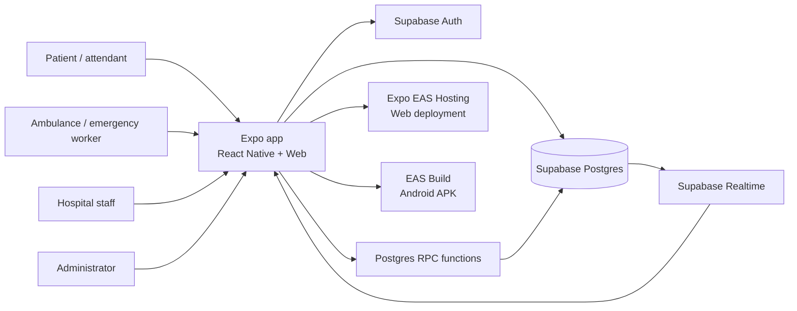
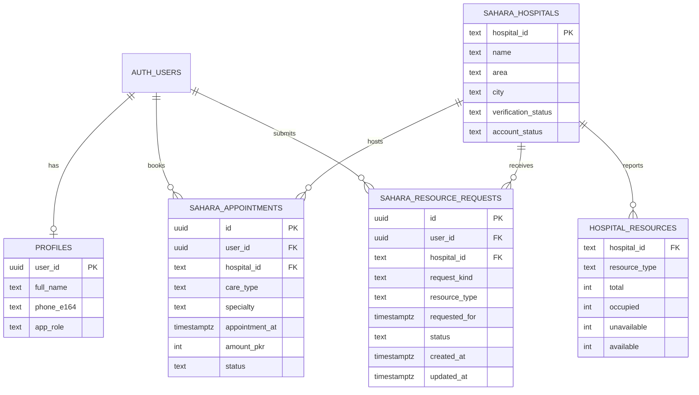

# Sahara Architecture

## 1. Overview

Sahara is an Expo React Native application for mobile and web. `mobile/App.tsx` currently owns the top-level screen state, search workflow, appointment booking, bed/room requests, and Supabase refresh lifecycle. Feature-specific UI lives under `mobile/src/features/`. Facility and specialty catalogues are bundled JSON files; the prototype reads live-updating capacity and user workflow data from Supabase.

There is no separate custom backend service. The app calls Supabase Auth, Postgres tables, Postgres functions (RPC), and Realtime directly using the public publishable key. Database permissions and functions therefore define the backend boundary.

## 2. System context

## 3. Repository components

| Path | Responsibility |
| --- | --- |
| `mobile/App.tsx` | App-level auth state, patient search, filters, location, appointment scheduling, bed/room/referral submission, Supabase reads, polling, and Realtime subscription. |
| `mobile/src/features/auth/AuthScreen.tsx` | Email/password registration and sign-in UI, Pakistani phone format validation, account role selection, and visible feedback. |
| `mobile/src/features/dashboard/DashboardScreen.tsx` | Hospital staff, ambulance/emergency worker, and administrator dashboards. |
| `mobile/src/data/hospitals.json` | Bundled Hyderabad facility catalogue and reported resource/price data used for discovery and fallbacks. Source data is not independently verified. |
| `mobile/src/data/specialties.json` | Specialty catalogue and input suggestions. |
| `mobile/src/lib/supabase.ts` | Supabase JS client initialization from `EXPO_PUBLIC_SUPABASE_URL` and `EXPO_PUBLIC_SUPABASE_PUBLISHABLE_KEY`. |
| `mobile/supabase/schema.sql` | Base profile and care/staff-request schema and row-level security setup. |
| `mobile/supabase/migrations/` | Demo seed data, request functions, capacity updates, admin review, duplicate prevention, and request scheduling. |
| `mobile/app.json` | Expo app identity, platform settings, permissions, and EAS project ID. |
| `mobile/eas.json` | EAS build profiles. `preview` is an internal Android APK profile. |

## 4. Runtime and data flow

### Sign-up and sign-in

1. The user enters email/password and, during registration, name and a Pakistani mobile number.
2. The app validates the input and calls Supabase Auth.
3. A database trigger creates a `profiles` row. The prototype role choice is stored in user metadata for selecting a dashboard.
4. The app restores the Supabase session on launch and opens the corresponding dashboard.

Email confirmation is expected to be disabled in the configured hackathon project for immediate sign-in. Staff role selection is a demo convenience, not proof of identity or authorization.

### Hospital search

1. User selects a need, location (GPS or typed area), urgency, radius, budget, provider type, specialty, 24-hour availability, and ambulance availability.
2. The app filters the bundled facility catalogue using reported services and capacity. Live capacity rows from `hospital_resources` take precedence when available.
3. If coordinates are available, distance is straight-line distance calculated locally and used to filter and sort. It is not road distance or live travel time.

### Appointment

1. User selects a hospital and appointment date/time.
2. The app calls `create_demo_appointment`.
3. The appointment is stored in `sahara_appointments` and presented as immediately confirmed for the prototype.
4. Appointments do not reserve or consume hospital capacity. The doctor name is a placeholder until a real scheduling integration exists.

### Bed/room request

1. Patient selects a hospital/resource, requested date/time, and optional note.
2. The app calls `create_sahara_resource_request`.
3. The pending row appears in the selected hospital’s staff queue and the requester’s dashboard.
4. Hospital staff accept or reject using `review_sahara_resource_request`.
5. Acceptance atomically decreases `available` and increases `occupied` in `hospital_resources`. Rejection does not change capacity. A partial unique index prevents duplicate pending requests by the same user for the same hospital/resource/kind.

### Emergency referral

1. Ambulance/emergency worker selects a hospital and emergency resource and enters an optional transfer note.
2. The request is stored as a `referral` in `sahara_resource_requests` and is visible to hospital staff.
3. Hospital staff can accept/reject; after acceptance, the coordinator can confirm patient transfer.

### Updates

The app subscribes to Postgres changes for `sahara_resource_requests` and also polls every four seconds as a fallback. Capacity, appointments, requests, and hospital review status are refreshed from Supabase.

## 5. Main data entities

The full schema and function definitions live in `mobile/supabase/schema.sql` and the migration files. The bundled `hospitals.json` is also used directly by the client; the current project therefore has both static catalogue fields and seeded Supabase records that need to remain in sync.

## 6. Security and trust boundaries

- The Supabase publishable key is a client-side key. A `service_role` key must never be placed in the app or repository.
- Database tables use Row Level Security, and state-changing workflows are implemented as Postgres functions.
- The current hackathon policies intentionally open several workflows to signed-in demo users. Any signed-in user can choose a role dashboard; this is not production authorization.
- The current data includes synthetic or unverified facilities, availability, prices, appointments, and doctors. Do not enter real patient health details or rely on capacity for care decisions.
- Production readiness requires trusted staff onboarding, server-enforced role permissions, audited facility data, privacy review, operational monitoring, and protection of patient information.

## 7. Environments and releases

### Local development

`mobile/.env` supplies the public Supabase URL/key to Expo. The file is ignored by Git and must not contain privileged secrets. Use `npm ci` and `npx expo start` from `mobile/`.

### Web

Expo exports the mobile app to static web assets and EAS Hosting serves the production alias `https://sahara-support.expo.app`. A production deploy moves the alias to a new deployment; Android APK builds do not change this web deployment.

### Android

The `preview` EAS profile builds an installable APK for internal sharing. Keep the Android application ID, EAS project ID, and signing credentials stable for updates to existing installs. The APK and web release are separate.

## 8. Current constraints

- Single-city dataset: Hyderabad, Sindh.
- No hospital-system integrations or verified real-time availability feed.
- No road routing or live travel-time calculation.
- Appointment auto-confirmation is a demo workflow, not a hospital-authorized booking.
- Sample figures and open role selection are unsuitable for production care coordination.
